# Query Results

Screenshots from Google BigQuery for each query. Queries are grouped by theme.

---

## 01 - Exploratory

### Q1: Total number of records
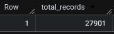

**Result:** 27,901 records in the dataset.

---

### Q2: Distinct values per categorical column
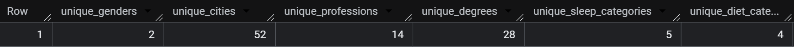

**Result:** 2 genders, 52 cities, 14 professions, 28 degree types, 5 sleep categories, 4 dietary habit categories.

---

### Q3: NULL checks
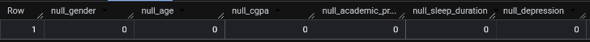

**Result:** No NULL values found in any key column - dataset is complete and ready for analysis.

---

### Q4: Age distribution
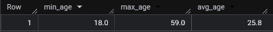

**Result:** Students range from 18 to 59 years old, with an average age of 25.8.

---

### Q5: Overall depression rate
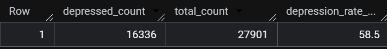

**Result:** 16,336 out of 27,901 students (58.5%) are classified as depressed - a notably high prevalence in the dataset.

---

### Q6: Gender breakdown
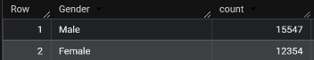

**Result:** 15,547 male students (55.7%) and 12,354 female students (44.3%).

---

### Q7: Top 10 cities by student count
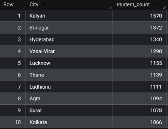

**Result:** Kalyan leads with 1,570 students, followed by Srinagar (1,372) and Hyderabad (1,340).

---

## 02 - Depression by Demographics

### Q8: Depression rate by gender
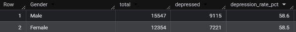

**Result:** Depression rate is nearly identical across genders - 58.6% for males and 58.5% for females. Gender alone is not a differentiating factor.

---

### Q9: Depression rate by age group
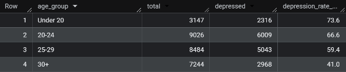

**Result:** Younger students are significantly more affected. The "Under 20" group has the highest depression rate at 73.6%, dropping steadily to 41.0% for students aged 30+. One of the strongest demographic patterns in the dataset.

---

### Q10: Depression rate by degree
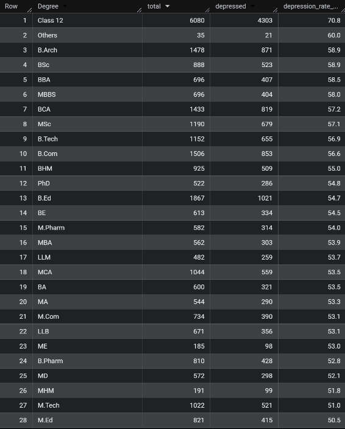

**Result:** Class 12 students have the highest depression rate at 70.8%, followed by B.Arch (58.9%) and BSc (58.9%). Postgraduate students tend to have lower rates, with M.Ed at the bottom at 50.5%.

---

### Q11: Depression rate by city (cities with 100+ records)
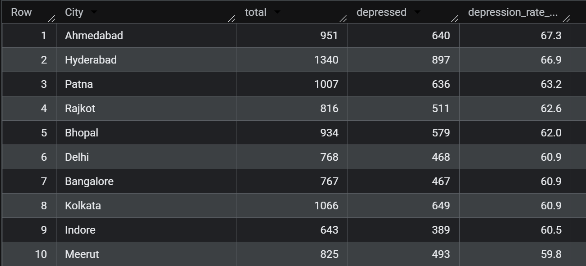

**Result:** Ahmedabad leads with 67.3%, followed by Hyderabad (66.9%) and Patna (63.2%). All top 10 cities exceed 59%, suggesting depression is prevalent regardless of location.

---

## 03 - Lifestyle Factors

### Q12: Depression rate by sleep duration
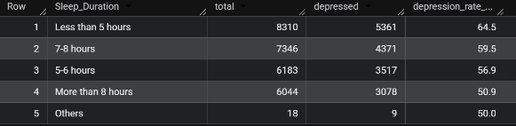

**Result:** Students sleeping less than 5 hours have the highest depression rate at 64.5%, while those sleeping more than 8 hours have the lowest at 50.9%. Clear pattern - less sleep correlates with higher depression.

---

### Q13: Depression rate by dietary habits
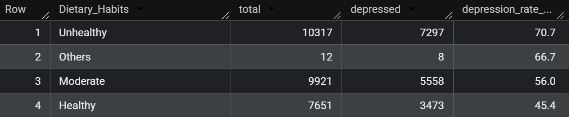

**Result:** Students with unhealthy diets show a 70.7% depression rate, compared to 56.0% for moderate and 45.4% for healthy. Diet is one of the stronger lifestyle predictors in the dataset.

---

### Q14: Average work/study hours - depressed vs non-depressed
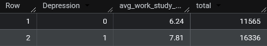

**Result:** Depressed students average 7.81 work/study hours per day vs 6.24 for non-depressed - a difference of over 1.5 hours daily.

---

### Q15: Depression rate by work/study hours bucket
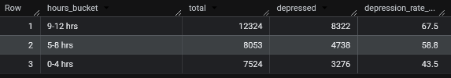

**Result:** Students studying 9–12 hours/day have a 67.5% depression rate, dropping to 43.5% for those studying 0–4 hours. Heavier workloads correlate clearly with higher depression.

---

### Q16: Sleep + diet combined vs depression rate
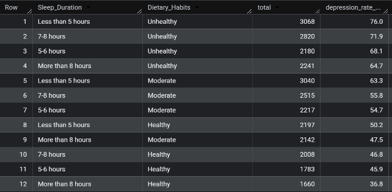

**Result:** The worst combination is less than 5 hours of sleep + unhealthy diet at 76.0%. The best is more than 8 hours of sleep + healthy diet at 36.8% - a 40 percentage point difference, highlighting how lifestyle factors compound each other.

---

## 04 - Academic & Financial Pressure

### Q17: Depression rate by academic pressure level
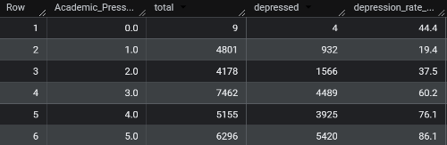

**Result:** The relationship is stark - at pressure level 1, only 19.4% of students are depressed. At level 5, that figure jumps to 86.1%. One of the strongest single predictors in the entire dataset.

---

### Q18: Average CGPA - depressed vs non-depressed
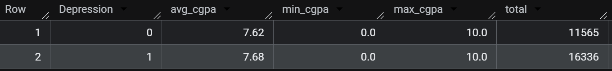

**Result:** Average CGPA is virtually identical - 7.62 for non-depressed and 7.68 for depressed students. CGPA alone has no meaningful relationship with depression in this dataset.

---

### Q19: Depression rate by CGPA range
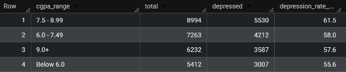

**Result:** Depression rates are similar across all CGPA ranges (55.6%–61.5%), confirming that academic performance does not predict depression. High achievers are just as likely to be depressed as lower performers.

---

### Q20: Depression rate by financial stress level
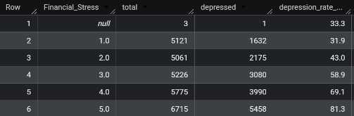

**Result:** At financial stress level 1, depression rate is 31.9%. At level 5, it reaches 81.3% - a nearly 50 percentage point difference. Financial stress is one of the most powerful predictors alongside academic pressure.

---

### Q21: Combined academic + financial pressure (top 10 combos)
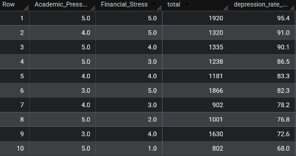

**Result:** The combination of academic pressure 5 + financial stress 5 yields a 95.4% depression rate. Even at 4+5 or 5+4, rates exceed 90%. Students facing maximum pressure on both fronts are almost certain to be classified as depressed.

---

## 05 - Risk Factors

### Q22: Depression rate by suicidal thoughts history
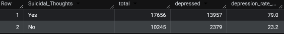

**Result:** Students who have had suicidal thoughts show a 79.0% depression rate, compared to just 23.2% for those who haven't. This is the single strongest binary predictor in the dataset - a 55.8 percentage point difference.

---

### Q23: Depression rate by family history of mental illness
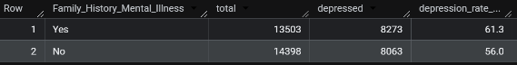

**Result:** Students with a family history of mental illness have a 61.3% depression rate vs 56.0% without. The gap is present but relatively modest, suggesting family history is a contributing factor rather than a primary driver.

---

### Q24: Depression rate by study satisfaction
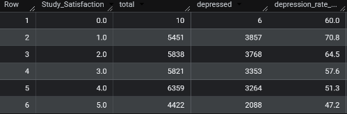

**Result:** Clear inverse relationship - at satisfaction level 1, depression rate is 70.8%, falling to 47.2% at level 5. Students who enjoy their studies are significantly less likely to be depressed.

---

### Q25: High-risk student profile - depression rate
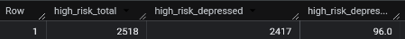

**Result:** Among students with academic pressure ≥ 4, financial stress ≥ 4, sleep ≤ 6 hours, and prior suicidal thoughts, 2,417 out of 2,518 (96.0%) are depressed. This compound risk profile is an near-certain indicator of depression.

---

### Q26: Study satisfaction and academic pressure by depression status
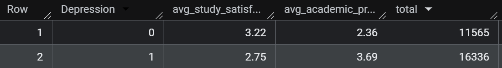

**Result:** Depressed students average 2.75 study satisfaction and 3.69 academic pressure. Non-depressed students average 3.22 satisfaction and 2.36 pressure. Both metrics move in opposite directions, reinforcing that low satisfaction combined with high pressure is a key depression pattern.
